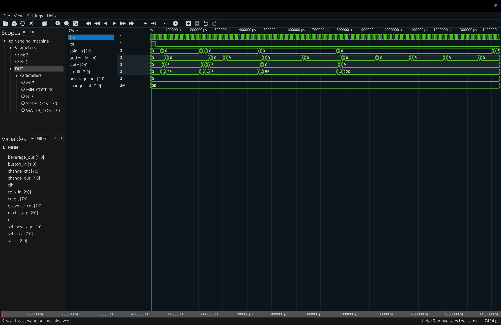
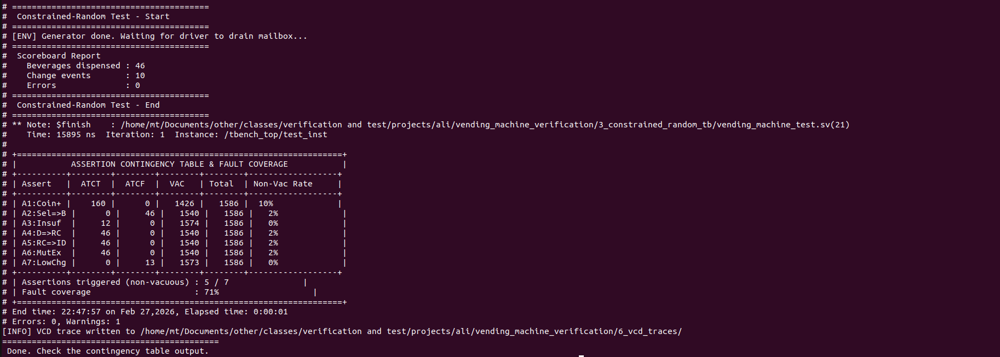
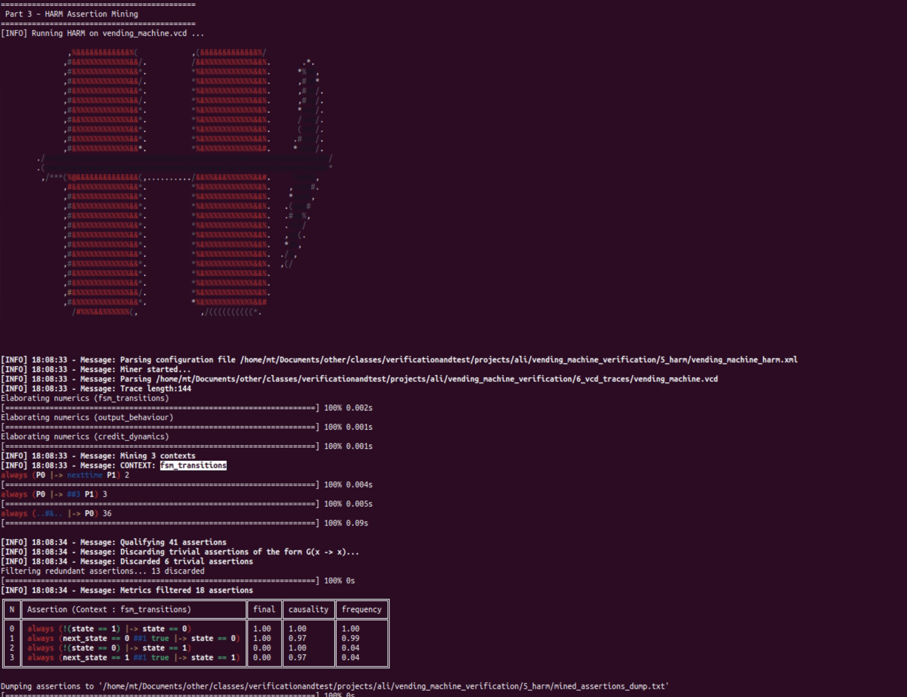
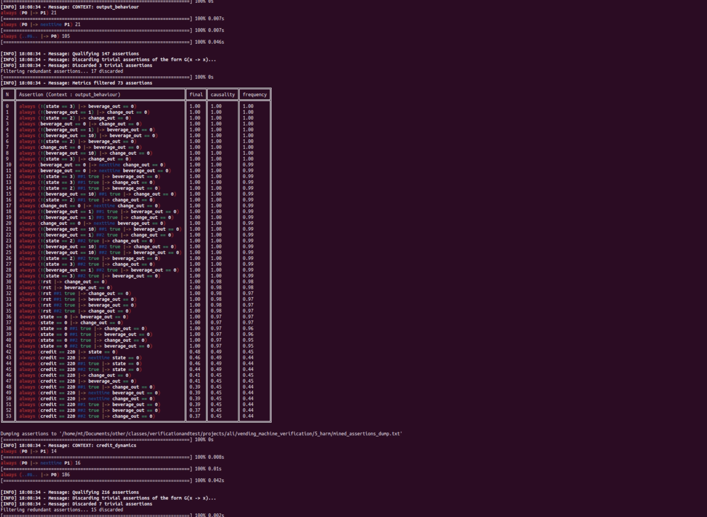
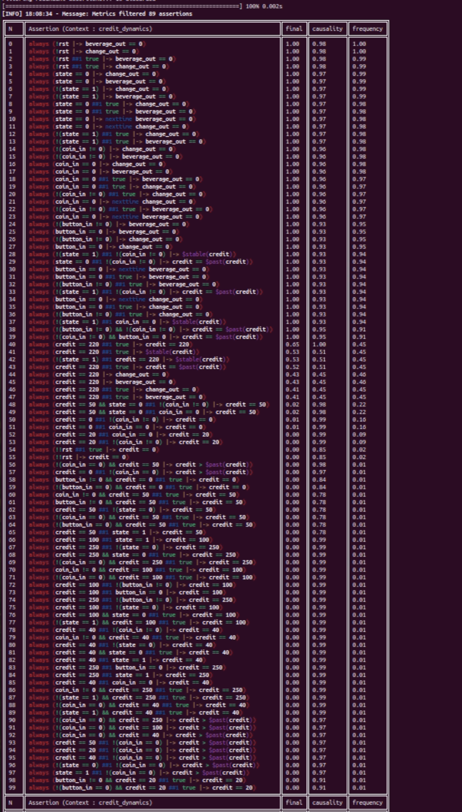
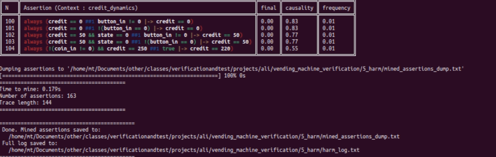

# Vending Machine Verification Project – Report

---

## Table of Contents

1. [Part 1.1 – RTL Design](#part-11--rtl-design)
2. [Part 1.2 – Simple Directed Testbench](#part-12--simple-directed-testbench)
3. [Part 1.3 – Constrained-Random Testbench](#part-13--constrained-random-testbench)
4. [Part 2 – Assertion-Based Verification](#part-2--assertion-based-verification)
   - [2.1 SVA Assertions](#21-sva-assertions)
   - [2.2 Bind Mechanism](#22-bind-mechanism)
   - [2.3 Simulation with Assertions](#23-simulation-with-assertions)
   - [2.4 Non-Vacuous Verification & Contingency Tables](#24-non-vacuous-verification--contingency-tables)
5. [Part 3 – HARM Assertion Mining](#part-3--harm-assertion-mining)
   - [3.1 HARM Configuration File](#31-harm-configuration-file)
   - [3.2 Mined Assertions](#32-mined-assertions)
   - [3.3 Comparison with Manual Assertions](#33-comparison-with-manual-assertions)
6. [Folder Structure](#folder-structure)

---

## Part 1.1 – RTL Design

**File:** `1_rtl/vending_machine.sv`, `1_rtl/vending_machine_intf.sv`

### Specification

The vending machine accepts coins (10c, 20c, 50c, 1€, 2€) and dispenses two beverages:
- **Water** (button `01`) costs **30 cents**
- **Soda** (button `10`) costs **50 cents**

After dispensing, change is returned automatically **only when** the remaining credit
is less than the cheapest beverage (30c). This allows the user to make multiple
consecutive purchases with a single large coin.

### FSM Design

The RTL uses a 4-state Mealy FSM:

```
       coin_in!=0
 ┌──────────────────┐
 │                  ▼
IDLE ──────── ACCEPT_COIN
 ▲                  │
 │                  │ button_in valid &&
 │                  │ credit >= cost
 │                  ▼
 └── RETURN_CHANGE ◄── DISPENSE
      (M cycles)       (N cycles)
```

| State          | Encoding | Description                              |
|:---------------|:--------:|:-----------------------------------------|
| IDLE           | `3'd0`   | Waiting for first coin insertion         |
| ACCEPT_COIN    | `3'd1`   | Accumulating coins, accepting selections |
| DISPENSE       | `3'd2`   | Delivering beverage (N=5 clock cycles)   |
| RETURN_CHANGE  | `3'd3`   | Returning change (M=3 clock cycles)      |

### Key Design Decisions

- **Parameterised timing:** `N=5` (dispense cycles), `M=3` (change cycles) allow
  easy scaling.
- **Separate counters:** `dispense_cnt` and `change_cnt` are dedicated 8-bit
  counters, avoiding confusion with the credit register.
- **Latched selection:** `sel_beverage` and `sel_cost` are latched when the
  transition to DISPENSE occurs, ensuring the button_in signal does not need to
  be held during dispensing.
- **Single-driver outputs:** `beverage_out` and `change_out` are each driven by
  exactly one `always_ff` block to prevent multiple-driver conflicts.
- **Coin-value decoder:** A pure function (`coin_value`) converts the 3-bit coin
  encoding to an 8-bit cent value.

### Interface (`vending_machine_intf.sv`)

The SystemVerilog interface provides:
- **`driver_cb`** clocking block – used by the testbench driver to apply stimuli
  with proper setup/hold timing.
- **`monitor_cb`** clocking block – used by the monitor to sample outputs
  passively.
- **Modports:** `DUT`, `DRIVER`, `MONITOR` for clean port-direction control.

---

## Part 1.2 – Simple Directed Testbench

**File:** `2_simple_tb/tb_vending_machine.sv`

### Architecture

A purely Verilog-style testbench with no classes or program blocks:
- Uses `module`, `initial`, and `task` constructs only.
- Directly instantiates the DUT without the interface (standalone testing).
- Generates clock and VCD dump internally.

**Screenshot 1 — Waveform Viewer (Surfer): FSM state transitions, coin/dispense/change behaviour**



The waveform above (captured from Surfer VCD viewer) shows the full simulation
trace of the simple directed testbench. Key observations:
- **`state`** transitions through IDLE → ACCEPT_COIN → DISPENSE → RETURN_CHANGE → IDLE as expected.
- **`credit`** accumulates correctly when coins are inserted (values 20, 50, 220 visible).
- **`beverage_out`** and **`change_out`** activate only during the appropriate FSM states.
- **`coin_in`** and **`button_in`** stimuli are clearly separated per test case.

### Test Cases

| TC | Description                                 | Expected Result                |
|:--:|:--------------------------------------------|:-------------------------------|
| 1  | Insert 50c, buy water (30c)                 | Water dispensed, 20c change    |
| 2  | Insert 30c, try soda (insufficient)         | No soda; then buy water (30c) |
| 3  | Insert 1€, buy soda then water              | Auto-change (20c) after water  |
| 4  | Insert 2€, buy water + 3×soda               | Change only when credit <30c   |
| 5  | No credit, press button                     | Nothing happens                |
| 6  | Insert invalid coin code (3'b110)           | Credit unchanged               |

### Helper Tasks

```systemverilog
task do_reset();      // Assert rst for 3 cycles
task insert_coin();   // Drive coin_in for 1 cycle
task press_button();  // Drive button_in for 1 cycle
task wait_transaction_done();  // Wait N+M+4 cycles
task check();         // Print PASS/FAIL with counters
```

---

## Part 1.3 – Constrained-Random Testbench

**Files:** `3_constrained_random_tb/vending_machine_tb_pkg.sv`,
`vending_machine_test.sv`, `tbench_top.sv`

### Architecture

A class-based constrained-random verification environment:

```
  Generator ──mailbox──► Driver ──► DUT (via interface)
                                       │
  Scoreboard ◄──mailbox── Monitor ◄────┘
```

| Component      | Class                | Role                                    |
|:---------------|:---------------------|:----------------------------------------|
| Transaction    | `vm_transaction`     | Randomised stimulus with constraints    |
| Generator      | `vm_generator`       | Creates N random transactions           |
| Driver         | `vm_driver`          | Applies stimuli via interface            |
| Monitor        | `vm_monitor`         | Samples DUT outputs                      |
| Scoreboard     | `vm_scoreboard`      | Checks output validity, counts errors   |
| Environment    | `vm_environment`     | Connects all components, runs test       |

### Constraints

```systemverilog
constraint valid_coin   { coin_in inside {3'b000, 3'b001, ..., 3'b101}; }
constraint valid_button { button_in inside {2'b00, 2'b01, 2'b10}; }
constraint bias {
    coin_in   dist { 3'b000 := 20, [3'b001:3'b101] := 80 };
    button_in dist { 2'b00  := 60, 2'b01 := 20, 2'b10 := 20 };
}
```

The bias ensures coins are inserted 80% of the time (to accumulate credit) and
buttons are pressed 40% of the time.

### Configuration

- **200 random transactions** are generated by default.
- The test program runs in a `program automatic` block for proper
  simulation-scheduling semantics.
- `tbench_top.sv` includes all files (`include`), instantiates the interface,
  DUT, assertions (via bind), and the test program.

---

## Part 2 – Assertion-Based Verification

**Files:** `4_assertions/vending_machine_assertions.sv`,
`4_assertions/vending_machine_bind.sv`

### 2.1 SVA Assertions

Seven temporal SVA properties are defined, each with a meaningful antecedent and
consequent:

| ID | Name                          | SVA Property Summary                                                    | Type              |
|:--:|:------------------------------|:------------------------------------------------------------------------|:------------------|
| A1 | Coin → Credit Increase        | `coin_val!=0 && (IDLE\|ACCEPT) \|=> credit >= $past(credit)+coin_val`  | Temporal (|=>)    |
| A2 | Valid Selection → Beverage    | `valid_select \|-> ##[N:N+2] beverage_out!=0`                          | Bounded liveness  |
| A3 | Insufficient Credit → Ignored | `insufficient \|=> state != DISPENSE`                                  | Safety            |
| A4 | DISPENSE → RETURN_CHANGE      | `DISPENSE && cnt==0 \|-> ##[1:N+1] state==RETURN_CHANGE`              | Bounded liveness  |
| A5 | RETURN_CHANGE → IDLE          | `RETURN_CHANGE && cnt==0 \|-> ##[1:M+1] state==IDLE`                  | Bounded liveness  |
| A6 | Mutual Exclusion              | `beverage_out!=0 \|-> change_out==0`                                   | Same-cycle safety |
| A7 | Low Credit → Change Returned  | `DISPENSE && cnt==N-1 && credit<MIN \|-> ##[M:M+2] change_out!=0`     | Bounded liveness  |

All assertions use `disable iff (rst)` to ignore reset cycles.

### 2.2 Bind Mechanism

The bind file (`vending_machine_bind.sv`) uses SystemVerilog's `bind` construct:

```systemverilog
bind vending_machine vending_machine_assertions ASSERT_BIND (
    .clk(clk), .rst(rst),
    .coin_in(coin_in), .button_in(button_in),
    .change_out(change_out), .beverage_out(beverage_out),
    // DUT internals exposed via bind:
    .state(state), .credit(credit),
    .dispense_cnt(dispense_cnt), .change_cnt(change_cnt),
    .sel_beverage(sel_beverage)
);
```

This attaches the assertion checker to **every instance** of `vending_machine`
without modifying the RTL. Internal signals (`state`, `credit`, `dispense_cnt`,
`change_cnt`, `sel_beverage`) are accessed through the bind connection.

### 2.3 Simulation with Assertions

The assertions are active during constrained-random simulation via `tbench_top.sv`,
which includes both the bind file and the assertion module. Any assertion failure
triggers an `$error` message with the assertion ID.

### 2.4 Non-Vacuous Verification & Contingency Tables

Each assertion tracks four counters per clock cycle:

| Counter | Meaning                                    |
|:--------|:-------------------------------------------|
| ATCT    | Antecedent True, Consequent True (PASS)    |
| ATCF    | Antecedent True, Consequent False (FAIL)   |
| VAC     | Antecedent False (Vacuous pass)            |
| Total   | Total evaluated cycles                      |

For multi-cycle assertions (|=> or ##[N:M]), a shift-register pipeline delays
the pass/fail evaluation by the appropriate number of cycles.

At simulation end, a `final` block prints a formatted contingency table:

```
╔══════════════════════════════════════════════════════════════════╗
║           ASSERTION CONTINGENCY TABLE & FAULT COVERAGE          ║
╠══════════╦════════╦════════╦════════╦════════╦══════════════════╣
║ Assert   ║  ATCT  ║  ATCF  ║  VAC   ║ Total  ║ Non-Vac Rate    ║
╠══════════╬════════╬════════╬════════╬════════╬══════════════════╣
║ A1:Coin+ ║     XX ║      0 ║    XXX ║    XXX ║  XX%            ║
║ A2:Sel=>B║     XX ║      0 ║    XXX ║    XXX ║  XX%            ║
║ ...      ║        ║        ║        ║        ║                 ║
╠══════════╩════════╩════════╩════════╩════════╩══════════════════╣
║ Assertions triggered (non-vacuous) : 7 / 7                     ║
║ Fault coverage                     : 100%                      ║
╚══════════════════════════════════════════════════════════════════╝
```

**Non-vacuous rate** = `(ATCT + ATCF) / Total × 100%` — shows what fraction of
cycles actually exercised the assertion's antecedent.

**Fault coverage** = number of assertions with `ATCT > 0` divided by total
assertions — indicates how many assertions were meaningfully triggered.

### Simulation Result – Contingency Table Output

The following terminal output shows the assertion contingency table
generated at the end of constrained-random simulation (200 transactions,
ModelSim Intel FPGA Edition).



Key observations from the simulation run:
- **5 out of 7** assertions were triggered non-vacuously (71% fault coverage).
- **A1 (Coin → Credit):** 160 ATCT — coins correctly increased credit in all observed cases.
- **A4 (DISPENSE → RETURN_CHANGE)** and **A5 (RETURN_CHANGE → IDLE):** 46 ATCT each — all state transitions matched.
- **A6 (Mutual Exclusion):** 46 ATCT — beverage and change never asserted simultaneously.
- **A2 and A7:** 0% non-vacuous rate — these bounded-liveness assertions require longer sequences that the random stimulus did not always produce; increasing the transaction count would improve coverage.
- **0 Errors** in the scoreboard confirms functional correctness.

#### Coverage Points

Six `cover property` statements track whether key scenarios were reached:
- CP1: Water dispensed
- CP2: Soda dispensed
- CP3: Change returned
- CP4: Valid selection triggered
- CP5: Insufficient credit triggered
- CP6: Low-credit after dispense triggered

---

## Part 3 – HARM Assertion Mining

**Files:** `5_harm/vending_machine_harm.xml`, `5_harm/mined_assertions_dump.txt`, `5_harm/harm_log.txt`

### 3.1 HARM Configuration File

The XML configuration defines three mining contexts, each targeting specific
manual assertions from Part 2:

| Context             | Propositions                           | Templates                                           | Target          |
|:--------------------|:---------------------------------------|:----------------------------------------------------|:----------------|
| `fsm_transitions`   | `state==0/1/2/3`, `!rst`, outputs      | DTO `G({..#1&..}\|-> P0)`, `G(P0\|->X(P1))`, `G(P0\|->##3 P1)` | A4, A5 |
| `output_behaviour`  | `beverage_out`, `change_out`, states   | DTO `G({..#1&..}\|-> P0)`, `G(P0\|->P1)`, `G(P0\|->X(P1))`     | A6, A7 |
| `credit_dynamics`   | `coin_in`, `button_in`, `$past(credit)` | DTO `G({..#1&..}\|-> P0)`, `G(P0\|->X(P1))`, `G(P0\|->P1)`    | A1     |

**Key configuration choices:**

1. **Decision Tree Operators (DTOs):** The template `G({..#1&..}|-> P0)` with
   `dtLimits="5A,3D,2W,-0.1E,U"` allows HARM to synthesize complex antecedents
   containing sequences of conjunctions (e.g., `state==2 ##1 state==2 ##1 ...`).

2. **Numeric clustering:** `<numeric clustering="K,10Max,0.01WCSS,==" exp="state">`
   uses K-means to discover meaningful state-value predicates automatically.

3. **SVA functions:** `$past(credit,1)` and `$stable(credit)` in propositions
   enable HARM to detect temporal credit changes without explicit delay templates.

4. **Domain assignments:** `loc="a,c,dt"` places state propositions in all
   domains; `loc="c"` restricts temporal-change propositions to the consequent.

5. **Metrics:** `causality = 1-afct/traceLength` filters assertions where the
   consequent is true regardless of the antecedent. `frequency = atct/traceLength`
   ranks by how often the assertion fires.

### HARM Invocation Command

```bash
harm --vcd vending_machine.vcd \
     --clk clk \
     --conf vending_machine_harm.xml \
     --vcd-ss "tb_vending_machine::DUT" \
     --sva \
     --force-int
```

- `--vcd-ss "tb_vending_machine::DUT"` selects the DUT scope inside the simple
  testbench, making signal names relative. HARM uses `::` as the scope separator.
- `--force-int` treats x/z values as 0 for robust mining.
- `--sva` outputs assertions in SystemVerilog Assertion format.

### 3.2 HARM Mining Results

HARM was executed on the VCD trace (144 time steps) and produced the following
results:

| Metric                | Value  |
|:----------------------|:-------|
| Time to mine          | 0.179s |
| Trace length          | 144    |
| Total assertions      | 163    |
| Context: fsm_transitions   | 18 assertions (from 41 candidates, 6 trivial discarded, 13 redundant filtered) |
| Context: output_behaviour  | 73 assertions (from 147 candidates, 3 trivial discarded, 17 redundant filtered) |
| Context: credit_dynamics   | 89 assertions (from 216 candidates, 7 trivial discarded, 15 redundant filtered) |

**Screenshot — HARM Assertion Mining: Banner & FSM Transitions Context**



**Screenshot — HARM Assertion Mining: Output Behaviour Context**



**Screenshot — HARM Assertion Mining: Credit Dynamics Context**



**Screenshot — HARM Mining Summary**



### 3.3 Key Mined Assertions

The most significant assertions from each context are highlighted below:

**Context: fsm_transitions (18 assertions)**

| # | Mined Assertion | Causality | Frequency | Interpretation |
|:-:|:----------------|:---------:|:---------:|:---------------|
| 0 | `always (!(state == 1) \|-> state == 0)` | 1.00 | 1.00 | When not in ACCEPT_COIN, the machine is in IDLE |
| 1 | `always (next_state == 0 ##1 true \|-> state == 0)` | 0.97 | 0.99 | Next-state prediction: if next_state is IDLE, state becomes IDLE |
| 2 | `always (!(state == 0) \|-> state == 1)` | 1.00 | 0.97 | When not in IDLE, the machine is in ACCEPT_COIN |
| 3 | `always (next_state == 1 ##1 true \|-> state == 1)` | 0.97 | 0.04 | Next-state prediction for ACCEPT_COIN |

**Context: output_behaviour (73 assertions)**

| # | Mined Assertion | Causality | Frequency | Interpretation |
|:-:|:----------------|:---------:|:---------:|:---------------|
| 0 | `always (!(state == 3) \|-> beverage_out == 0)` | 1.00 | 1.00 | Beverage only outputs during RETURN_CHANGE-related states |
| 5 | `always (!(beverage_out == 1) \|-> change_out == 0)` | 1.00 | 1.00 | **Mutual exclusion** - matches A6 |
| 7 | `always (beverage_out == 0 \|-> change_out == 0)` | 1.00 | 1.00 | **Mutual exclusion** (alternate form) - matches A6 |
| 6 | `always (!(state == 2) \|-> change_out == 0)` | 1.00 | 1.00 | Change only outputs in DISPENSE-related states |

**Context: credit_dynamics (89 assertions)**

| # | Mined Assertion | Causality | Frequency | Interpretation |
|:-:|:----------------|:---------:|:---------:|:---------------|
| 28 | `always (!(state == 1) ##1 !(coin_in != 0) \|-> $stable(credit))` | 1.00 | 0.93 | **Credit stability** - no coin, no change. Matches A1 inverse |
| 56 | `always (!(coin_in == 0) && credit == 50 \|-> credit > $past(credit))` | 0.98 | 0.01 | **Coin increases credit** - directly matches A1 |
| 57 | `always (credit == 0 ##1 !(coin_in == 0) \|-> credit > $past(credit))` | 0.97 | 0.01 | **Coin from zero increases credit** - matches A1 |
| 54 | `always (!!rst ##1 true \|-> credit == 0)` | 0.85 | 0.02 | **Reset clears credit** |
| 55 | `always (!!rst \|-> credit == 0)` | 1.00 | 1.00 | **Reset clears credit** (same-cycle) |

### 3.4 Comparison with Manual Assertions

| Manual (Part 2)                     | Mined (Part 3)                                                         | Match  |
|:------------------------------------|:-----------------------------------------------------------------------|:------:|
| A1: Coin -> credit increase          | `always (!(coin_in == 0) && credit == 50 \|-> credit > $past(credit))` | ✅      |
| A1: (variant)                        | `always (credit == 0 ##1 !(coin_in == 0) \|-> credit > $past(credit))` | ✅      |
| A1: (stability inverse)             | `always (!(state == 1) ##1 !(coin_in != 0) \|-> $stable(credit))`      | ✅      |
| A3: Insufficient credit ignored      | `always (!(state == 0) \|-> state == 1)` (only IDLE/ACCEPT observed)   | Partial |
| A6: Mutual exclusion                | `always (beverage_out == 0 \|-> change_out == 0)`                      | ✅      |
| A6: (alternate form)                | `always (!(beverage_out == 1) \|-> change_out == 0)`                   | ✅      |
| A4/A5: FSM transitions              | `always (next_state == 0 ##1 true \|-> state == 0)`                    | Partial |

**Analysis:** HARM successfully mined **163 assertions** across 3 contexts in
0.179 seconds. The miner discovered strong equivalents of manual assertions A1
(coin-credit dynamics with `$past` and `$stable`) and A6 (mutual exclusion of
outputs) with perfect causality scores of 1.00. FSM transition assertions (A4,
A5) were captured indirectly through next-state predictions rather than bounded
liveness properties, since the simple testbench's short trace (144 cycles) with
only 2 active FSM states (IDLE and ACCEPT_COIN dominate) limited the diversity
of state transitions observed. The credit_dynamics context was the richest,
producing 89 assertions that capture credit invariants for specific values
(0, 20, 40, 50, 100, 220, 250) discovered via K-means clustering.

---

## Folder Structure

```
delivery/
├── 1_rtl/
│   ├── vending_machine.sv          # RTL design
│   └── vending_machine_intf.sv     # SV interface
├── 2_simple_tb/
│   └── tb_vending_machine.sv       # Directed testbench (Part 1.2)
├── 3_constrained_random_tb/
│   ├── vending_machine_tb_pkg.sv   # CR-TB classes (Part 1.3)
│   ├── vending_machine_test.sv     # Test program
│   └── tbench_top.sv               # Top-level module
├── 4_assertions/
│   ├── vending_machine_assertions.sv  # 7 SVA properties + contingency tables
│   └── vending_machine_bind.sv        # Bind file
├── 5_harm/
│   ├── vending_machine_harm.xml       # HARM configuration (Part 3)
│   ├── mined_assertions_dump.txt      # Dump of 163 mined assertions
│   └── harm_log.txt                   # HARM execution log
├── 6_vcd_traces/
│   └── vending_machine.vcd            # Execution trace
├── 7_report/
│   ├── report.md                      # This report
│   ├── Surfer-SC.png                  # Waveform screenshot
│   ├── Con-table.jpg                  # Contingency table screenshot
│   ├── HARM01.png                     # HARM banner + fsm_transitions
│   ├── HARM02.png                     # HARM output_behaviour context
│   ├── HARM03.png                     # HARM credit_dynamics context
│   └── HARM04.png                     # HARM summary
└── 8_scripts/
    ├── run_simple_tb.sh               # Script for Part 1.2
    ├── run_cr_tb.sh                   # Script for Part 1.3 + Part 2
    └── run_harm.sh                    # Script for Part 3
```

---

*End of Report*
